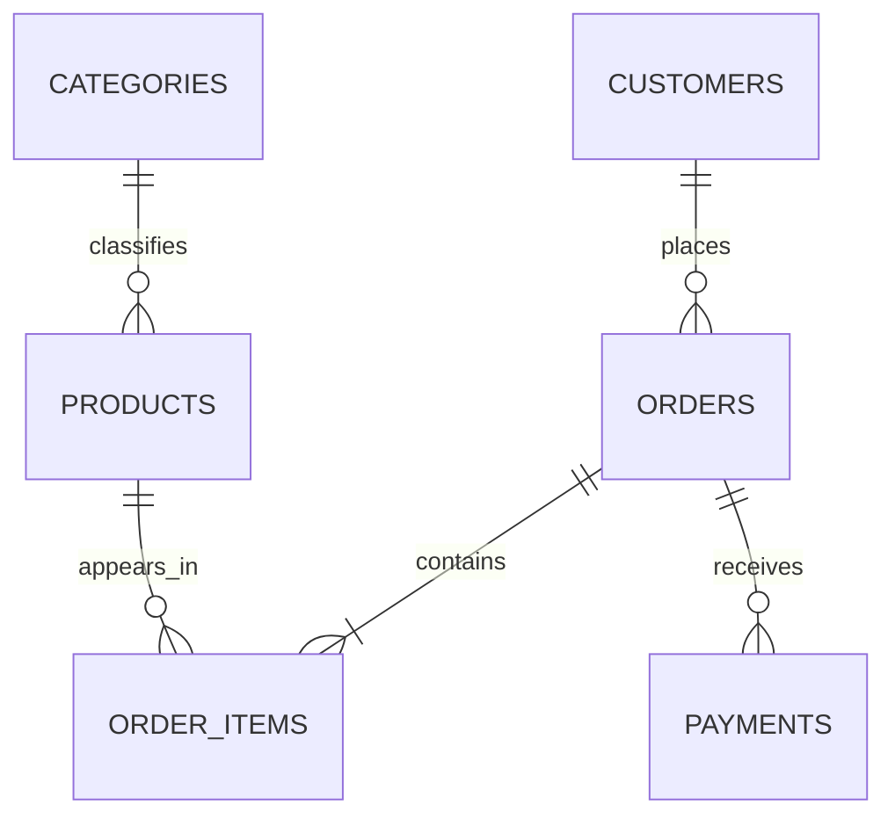

# PostgreSQL for Developers — Hands-On Kit

This kit uses one continuous case study: **TechStore Order Management**.

## Learning path

| Module | Main skills | Script |
|---|---|---|
| 1 | Environment, database, schemas | `00_create_database.sql`, `01_schema.sql` |
| 2 | Data types, constraints, INSERT/UPDATE/DELETE | `02_seed_data.sql`, `03_crud.sql` |
| 3 | SELECT, filtering, joins, aggregation | `04_queries.sql` |
| 4 | Subqueries, CTEs, set operations, window functions | `05_advanced_queries.sql` |
| 5 | Views, functions, procedures, triggers | `06_programmability.sql` |
| 6 | Transactions, savepoints, locking concepts | `07_transactions.sql` |
| 7 | Indexes, EXPLAIN, roles and privileges | `08_performance_security.sql` |

## Requirements

- PostgreSQL 14 or later
- pgAdmin 4 or `psql`
- Permission to create a database (or ask the trainer to create `techstore_db`)

## Quick start with pgAdmin

1. Open **Query Tool** while connected to the default `postgres` database.
2. Run `scripts/00_create_database.sql`.
3. Reconnect Query Tool to `techstore_db`.
4. Run scripts `01` through `08` in order.
5. Use `09_student_challenges.sql` for independent practice.
6. Compare work with `solutions/09_challenge_solutions.sql`.

## Quick start with psql

```bash
psql -U postgres -f scripts/00_create_database.sql
psql -U postgres -d techstore_db -f scripts/01_schema.sql
psql -U postgres -d techstore_db -f scripts/02_seed_data.sql
```

Continue with scripts `03` through `08`. Do not use `run_all.sql` from pgAdmin because it contains `psql` connection commands.

## Reset

- To keep the database but rebuild all objects, run `scripts/99_reset.sql`, then scripts `01`–`08`.
- To remove the whole database, connect to `postgres` and run the commented command in `00_create_database.sql` only after confirming that no work must be retained.

## Dataset relationships



## Trainer notes

The scripts contain `PAUSE`, `TRY`, and `DISCUSS` comments. Run one section at a time instead of executing an entire demonstration script without explanation.

