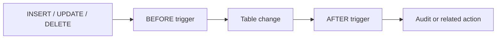
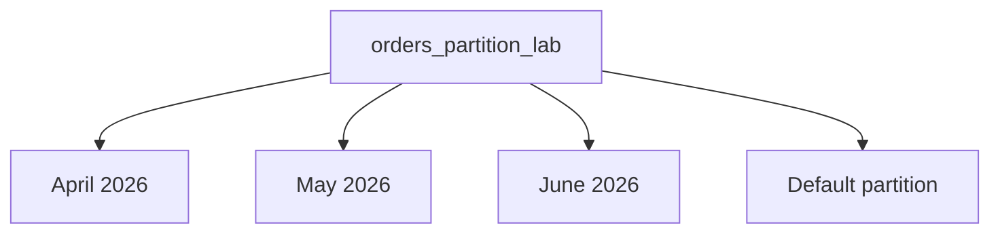
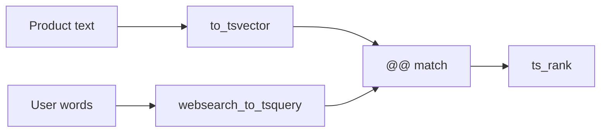

# Module 7 Hands-On: Triggers, Partitioning and Full-Text Search

## Case study

TechStore needs to:

1. record every product price change automatically;
2. prevent stock from becoming negative;
3. store a growing order archive by month; and
4. provide a fast, ranked product search.

This lab uses the existing `techstore_db` database and the `sales` and `audit`
schemas created in the earlier modules.

## Learning outcomes

By the end of this lab, participants can:

- explain the difference between a trigger function and a trigger;
- use `OLD`, `NEW`, `BEFORE`, `AFTER`, `FOR EACH ROW` and `WHEN`;
- inspect and safely remove triggers;
- create range-partitioned tables and monthly partitions;
- confirm which physical partition contains a row;
- observe partition pruning with `EXPLAIN`;
- create `tsvector` documents and `tsquery` search expressions;
- create a GIN index and rank full-text-search results.

## Suggested duration

| Section | Activity | Time |
|---|---|---:|
| A | Setup and checks | 10 min |
| B | Trigger demonstrations | 35 min |
| C | Range partitioning | 40 min |
| D | Full-text search | 40 min |
| E | Student challenge and review | 25 min |
|  | **Total** | **150 min** |

## Files

- `scripts/07a_trigger_partition_fts_setup.sql` — trainer setup and demonstrations
- `scripts/07b_trigger_partition_fts_student_lab.sql` — student questions and TODO areas
- `solutions/07_module7_trigger_partition_fts_solutions.sql` — complete answers

## Preparation

Run the core database scripts first:

```text
01_schema.sql
02_seed_data.sql
```

The trigger section can reuse objects from `06_programmability.sql`, but the
Module 7 setup script also creates or replaces the required objects and is safe
to rerun.

---

# Part A — Triggers

## 1. Trigger execution model



| Term | Meaning |
|---|---|
| Trigger function | A function declared with `RETURNS trigger` |
| Trigger | Connects an event on a table to a trigger function |
| `OLD` | Row before an `UPDATE` or `DELETE` |
| `NEW` | Row after an `INSERT` or `UPDATE` |
| `BEFORE` | Runs before the row is stored and may validate/change `NEW` |
| `AFTER` | Runs after the change succeeds; useful for audit logs |
| `FOR EACH ROW` | Runs once for every affected row |
| `WHEN` | Prevents unnecessary trigger-function calls |

## 2. Price-audit demonstration

The lab creates an `AFTER UPDATE` trigger. It runs only when `unit_price`
actually changes:

```sql
UPDATE sales.products
SET unit_price = unit_price + 10
WHERE product_id = 2;

SELECT *
FROM audit.product_price_log
WHERE product_id = 2
ORDER BY changed_at DESC;
```

Discussion:

- Why is `AFTER` suitable for an audit record?
- Why use `IS DISTINCT FROM` instead of `<>`?
- If five products are updated, how many times does a row trigger run?

## 3. Stock-validation demonstration

A `BEFORE INSERT OR UPDATE OF stock_qty` trigger rejects negative stock.

```sql
BEGIN;

UPDATE sales.products
SET stock_qty = -1
WHERE product_id = 2;

ROLLBACK;
```

The update raises an exception. If using pgAdmin and the transaction becomes
aborted, run `ROLLBACK;` before continuing.

## 4. Inspect triggers

```sql
SELECT
    event_object_schema,
    event_object_table,
    trigger_name,
    action_timing,
    event_manipulation
FROM information_schema.triggers
WHERE event_object_schema IN ('sales', 'audit')
ORDER BY event_object_table, trigger_name, event_manipulation;
```

---

# Part B — Range Partitioning

## 1. Why partition?

Partitioning divides one logical table into physical child tables. It is most
useful for very large tables when queries and maintenance commonly use the
partition key.

This lab partitions an order archive by `order_date`.



Important rule: a primary key or unique constraint on a partitioned table must
include every partition-key column. Therefore the lab uses:

```sql
PRIMARY KEY (order_id, order_date)
```

## 2. Confirm row routing

`tableoid::regclass` reveals the physical partition:

```sql
SELECT
    tableoid::regclass AS physical_partition,
    order_no,
    order_date
FROM sales.orders_partition_lab
ORDER BY order_date;
```

Rows are inserted into the parent table. PostgreSQL routes each row to the
matching child partition.

## 3. Observe partition pruning

```sql
EXPLAIN (ANALYZE, COSTS OFF)
SELECT *
FROM sales.orders_partition_lab
WHERE order_date >= DATE '2026-05-01'
  AND order_date <  DATE '2026-06-01';
```

The plan should access only the May partition. This is partition pruning:
partitions that cannot contain matching rows are excluded.

## 4. Add a future partition

Before detaching data from the default partition, first check whether the
default partition contains rows in the new range. The setup uses June as an
explicit partition and routes July dates to the default partition so students
can see both behaviours.

Production operations such as attaching, detaching or dropping partitions
must be planned carefully because they lock objects and can affect data.

---

# Part C — Full-Text Search

## 1. Search pipeline



| Object | Purpose |
|---|---|
| `tsvector` | Normalized document lexemes |
| `tsquery` | Search terms and Boolean operators |
| `@@` | Tests whether the vector matches the query |
| `ts_rank` | Calculates relevance |
| GIN index | Speeds up containment-style text search |

The search document gives product names weight `A` and category/description
weight `B`, so a match in a product name normally ranks higher.

## 2. Compare `LIKE` and full-text search

Basic substring search:

```sql
SELECT product_name
FROM sales.product_search_lab
WHERE product_name ILIKE '%router%';
```

Full-text search:

```sql
SELECT product_name
FROM sales.product_search_lab
WHERE search_vector @@ websearch_to_tsquery('english', 'wireless router');
```

Full-text search understands normalized words, operators and relevance. It is
not a drop-in replacement for every substring, SKU or typo-tolerant search.

## 3. Ranked search

```sql
WITH q AS (
    SELECT websearch_to_tsquery('english', 'portable storage') AS query
)
SELECT
    p.product_name,
    p.category_name,
    ts_rank(p.search_vector, q.query) AS rank
FROM sales.product_search_lab AS p
CROSS JOIN q
WHERE p.search_vector @@ q.query
ORDER BY rank DESC, p.product_name;
```

## 4. Search syntax examples

```sql
-- Both concepts
SELECT websearch_to_tsquery('english', 'wireless router');

-- Either concept
SELECT websearch_to_tsquery('english', 'mouse OR keyboard');

-- Phrase
SELECT websearch_to_tsquery('english', '"portable storage"');

-- Exclusion
SELECT websearch_to_tsquery('english', 'storage -HDD');
```

---

# Student tasks

The student script contains 15 tasks:

1. inspect installed triggers;
2. create and verify one price-audit entry;
3. prove that an unrelated column change is not audited;
4. test the negative-stock rule safely;
5. explain `OLD` and `NEW`;
6. list all partitions;
7. count rows per physical partition;
8. insert rows into May and July and identify their destinations;
9. demonstrate partition pruning;
10. explain why the primary key includes `order_date`;
11. inspect stored search vectors;
12. search for `wireless`;
13. search for `mouse OR keyboard`;
14. rank results for `portable storage`;
15. inspect whether the GIN index can support a search.

## Completion check

Students should be able to answer:

- Which trigger timing is appropriate for validation? Why?
- Which trigger timing is appropriate for audit logging? Why?
- Does partitioning automatically make every query faster?
- Why must queries filter by the partition key to benefit from pruning?
- What is the difference between a `tsvector` and a `tsquery`?
- Why is a GIN index suitable for full-text search?

## Cleanup

To remove only Module 7 lab objects:

```sql
DROP TABLE IF EXISTS sales.product_search_lab;
DROP TABLE IF EXISTS sales.orders_partition_lab;
DROP TRIGGER IF EXISTS trg_product_stock_guard ON sales.products;
DROP FUNCTION IF EXISTS sales.fn_validate_product_stock();
```

The price-audit objects are retained because they are also used by the
programmability module.
